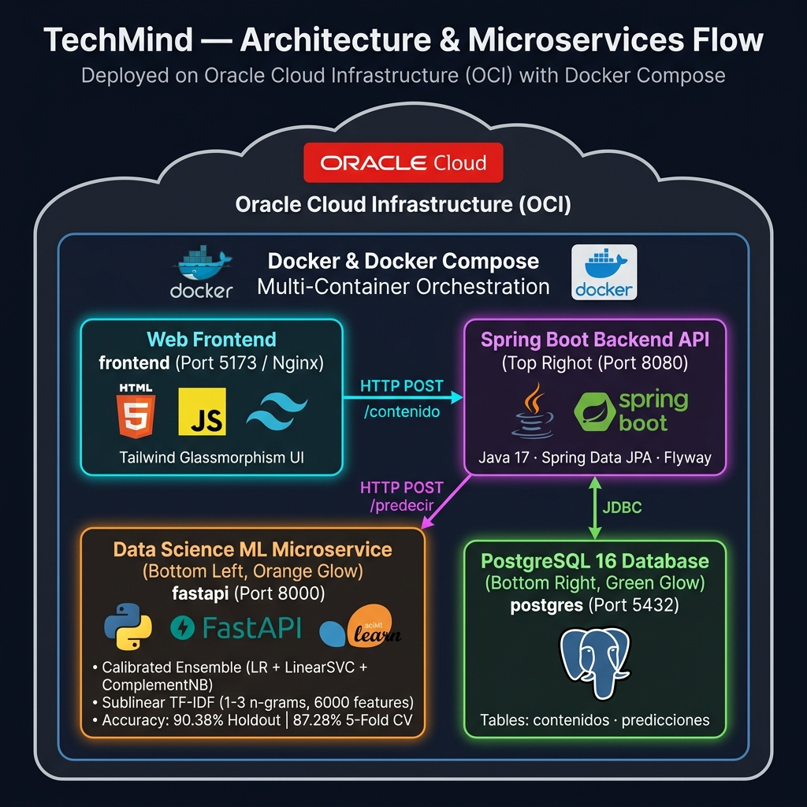

<div align="center">

# 🧠 TechMind
### Organización Inteligente del Conocimiento Técnico

[](https://www.oracle.com/java/)
[](https://spring.io/projects/spring-boot)
[](https://www.python.org/)
[](https://fastapi.tiangolo.com/)
[](https://scikit-learn.org/)
[](https://www.postgresql.org/)
[](https://www.docker.com/)
[](https://github.com/No-Country-simulation/g9-latam-techmind-team37)

**Hackathon TechMind · G9 LATAM · Equipo 37**

</div>

---

## 📌 ¿Qué es TechMind?

TechMind es una plataforma web inteligente para la **organización y clasificación automatizada de contenido técnico**. Mediante el análisis del título y cuerpo de un artículo, documento o fragmento de código, la plataforma procesa la información y responde en tiempo real con:

- 📂 La **categoría temática** del contenido (`Backend`, `Frontend`, `Data Science`, `DevOps`, `Mobile`, `Bases de Datos`, `Seguridad`, `Cloud`)
- 📊 El nivel de **confianza / probabilidad** de la predicción
- 🔑 Las **palabras clave** (keywords) más relevantes extraídas automáticamente mediante vectores TF-IDF
- 📜 Un **historial persistente** accesible desde la interfaz web con todas las clasificaciones registradas

---

## 🏗️ Arquitectura del Sistema

<div align="center">



</div>

```
┌───────────────────────────────────────────────────────────────────────────────────┐
│                    Oracle Cloud Infrastructure (OCI)                              │
│ ┌───────────────────────────────────────────────────────────────────────────────┐ │
│ │                  Docker & Docker Compose Multi-Container                      │ │
│ │                                                                               │ │
│ │ ┌───────────────────────────────────────────────────────────────────────────┐ │ │
│ │ │                   Cliente Web / Frontend (Nginx)                          │ │ │
│ │ │                   HTML5 + JS Vanilla + TailwindCSS                        │ │ │
│ │ │                   http://localhost:5173                                   │ │ │
│ │ └─────────────────────────────────────┬─────────────────────────────────────┘ │ │
│ │                                       │ HTTP POST /contenido                  │ │
│ │                                       ▼                                       │ │
│ │ ┌───────────────────────────────────────────────────────────────────────────┐ │ │
│ │ │            API Backend Principal — Spring Boot (Java 17)                  │ │ │
│ │ │            Puerto 8080 · JPA / Hibernate · Flyway Migrations              │ │ │
│ │ └──────────────┬──────────────────────────────────────────┬─────────────────┘ │ │
│ │                │ HTTP POST /predecir                      │ JDBC              │ │
│ │                ▼                                          ▼                   │ │
│ │ ┌──────────────────────────────┐          ┌──────────────────────────────┐    │ │
│ │ │ Microservicio Data Science   │          │ Base de Datos PostgreSQL 16  │    │ │
│ │ │ FastAPI (Python) · :8000     │          │ Puerto 5432                  │    │ │
│ │ │ Ensamble Calibrado (LR+SVC)  │          │ contenidos · predicciones    │    │ │
│ │ └──────────────────────────────┘          └──────────────────────────────┘    │ │
│ └───────────────────────────────────────────────────────────────────────────────┘ │
└───────────────────────────────────────────────────────────────────────────────────┘
```

---

## 🛠️ Tecnologías Utilizadas

### ☕ Back-End (Java / Spring Boot)
- **Java 17 (LTS)**: Lenguaje principal de backend transaccional.
- **Spring Boot 4.x**: Framework base para APIs REST.
- **Spring Data JPA / Hibernate**: ORM para la persistencia de datos.
- **Flyway**: Control de versiones y migraciones automáticas de base de datos (`V1__create_tables.sql`).
- **Lombok**: Reducción de código repetitivo (Getters, Setters, Constructors).
- **Maven Wrapper**: Gestión de dependencias y builds reproducibles.

### 🤖 Ciencia de Datos & Machine Learning (Python / FastAPI)
- **Python 3.12**: Entorno de ejecución de inteligencia artificial.
- **FastAPI & Uvicorn**: Microservicio asíncrono de alto rendimiento.
- **Scikit-Learn**:
  - `TfidfVectorizer` (sublineal, 6.000 características, n-gramas 1 a 3) para extracción de features y keywords.
  - **Ensamble Calibrado (`VotingClassifier` Soft Voting)**: combina `LogisticRegression`, `CalibratedClassifierCV(LinearSVC)` y `ComplementNB` para máxima precisión y estimación de confianza.
  - **Validación Cruzada Estratificada (K=5)** en desarrollo/notebook (87.28% CV Accuracy, 90.38% Holdout).
- **Pandas & NumPy**: Procesamiento, augmentación de datos y limpieza del dataset técnico.
- **Joblib**: Serialización y des-serialización de modelos entrenados.

### 🎨 Front-End (Web UI)
- **HTML5 & CSS3**: Estructura semántica moderna.
- **TailwindCSS v3**: Diseño **Cyber AI Dark Mode** con efecto Glassmorphism.
- **JavaScript Vanilla (ES6+)**: Consumo de APIs REST, sanitización de fechas ISO y control del modal de historial.
- **Nginx Alpine**: Servidor web liviano para la versión contenedorisada.

### 🗄️ Base de Datos e Infraestructura
- **PostgreSQL 16**: Motor relacional principal.
- **Docker & Docker Compose**: Orquestación multicontenedor (PostgreSQL, FastAPI, Spring Boot, Frontend).

---

## 👥 Equipo de Trabajo & Roles

| Integrante | Rol / Especialidad | Responsabilidades Principales |
|-----------|-------------------|--------------------------------|
| **Ernesto Llampa** | Data Science / Fullstack | Pipeline NLP, vectorización TF-IDF, entrenamiento del modelo, Integración completa, Frontend Web UI, auto-healing Docker & `setup.py` |
| **Leandro Villamil** | Data Science / ML | Pipeline NLP, vectorización TF-IDF y entrenamiento del modelo, demostración de cómo funciona el proyecto con pruebas piloto, análisis y pruebas, Frontend, diseño responsivo UI/UX |
| **Rómulo García Maygua** | Data Science / ML | Ingesta de datos, exploración EDA y notebooks |
| **Sergio Pablo Vilte** | Backend Java | Desarrollo API REST Spring Boot, controladores y servicio de predicción |
| **Andrés Felipe Rojas** | Backend Java | Configuración Spring Boot, entidades JPA y DTOs, Frontend, diseño responsivo UI/UX |
| **Noelia Rementeria** | Backend Java | Desarrollo API REST Spring Boot, configuración de base de datos y soporte backend |
| **Camila Fagina** | Backend Java | Soporte backend y lógica transaccional |
| **Federico Gutierrez** | Quality Assurance (QA) | Matriz de pruebas, testing manual de endpoints, Swagger y validación, Frontend |

---

## 📁 Estructura del Repositorio

```
g9-latam-techmind-team37/
│
├── app/                                   # Microservicio FastAPI (Python)
│   ├── main.py                            # API REST: /predecir, /health, /predicciones
│   ├── database.py                        # Consulta a PostgreSQL para el historial
│   └── Dockerfile                         # Imagen Docker de FastAPI
│
├── backend/                               # API Backend Principal (Spring Boot / Java)
│   ├── Dockerfile                         # Imagen Docker multi-stage de Spring Boot
│   └── api                                # Proyecto Maven / Spring Boot
│       ├── pom.xml
│       ├── src/main/java/api/             # Controladores, Entidades JPA, DTOs y Servicios
│       └── src/main/resources/            # application.properties y db/migration (Flyway)
│
├── frontend/                              # Frontend Web (UI Cyber AI)
│   ├── index.html                         # Interfaz gráfica Cyber AI Dark Mode Glassmorphism
│   ├── app.js                             # Consumo de APIs y rendering de Historial
│   └── Dockerfile                         # Imagen Docker Nginx para producción
│
├── data-science/                          # Módulo de Data Science y Machine Learning
│   ├── data/raw/contenidos_tecnicos.csv   # Dataset ampliado (221 registros técnicos)
│   ├── models/                            # Binarios serializados (.joblib)
│   ├── notebooks/TechMind_DataScience.ipynb # Notebook Jupyter interactivo
│   └── src/
│       ├── generate_models.py             # Entrenador offline ultrarrápido para auto-healing
│       ├── ingest_documents.py            # Ingesta masiva de documentos PDF / DOCX
│       └── migrate_to_postgres.py         # Carga inicial de datos a PostgreSQL
│
├── qa/                                    # Módulo de Quality Assurance
│   ├── casos-de-prueba/                   # Documentación de diseño de pruebas         
│   │   ├── (v1.1) Matriz de Bugs.xlsx
│   │   ├── (v1.1) Matriz de Mejoras.xlsx
│   │   └── (v4.0) Matriz de Casos de Prueba.xlsx         
│   ├── evidencias/                        # Respaldos y ejecuciones de las pruebas                   
│   │   ├── Capturas de Pantalla/  
│   │   │   ├── Backend (Spring Boot)/ 
│   │   │   ├── Base de Datos (PostgreSQL 16)/ 
│   │   │   ├── Data Science (FastAPI)/   
│   │   │   └── FrontEnd/    
│   │   │       ├── Bugs/ 
│   │   │       ├── Casos de Prueba/ 
│   │   │       └── Mejoras/      
│   │   └── JSON/
│   │       ├── Backend (Spring Boot)/ 
│   │       └── Data Science (FastAPI)/  
│   ├── reportes/                          # Informes y resultados finales
│   │   ├── informes/
│   │   │   └── (v3.0) Reporte de Resultados.pdf
│   │   ├── Reporte de BUGS/
│   │   │   ├── FIX-Columna-informaciones_adicionales.md
│   │   │   ├── FIX-Docker-multiarch-spring-boot.md 
│   │   │   ├── FIX-Indicadores-de-estado-congelados-en-rojo-al-iniciar-la-aplicacion.md
│   │   │   ├── FIX-Persistencia-del-formulario-tras-ejecutar-la clasificacion.md
│   │   │   └── FIX-Redundancia-en-controles-del-modal-de-JSON.md
│   │   ├── resultados-sprint-1.md         # Resumen ejecutivo de métricas, bugs encontrados del Sprint 1
│   │   ├── resultados-sprint-2.md         # Resumen ejecutivo de métricas, bugs encontrados del Sprint 2
│   │   ├── resultados-sprint-3.md         # Resumen ejecutivo de métricas, bugs encontrados del Sprint 3
│   │   └── resultados-sprint-4.md         # Resumen ejecutivo de métricas, bugs encontrados del Sprint 4
│   └── README.md                          # Documentación específica del módulo QA
│
│
├── docker-compose.yml                     # Configuración de los 4 servicios en Docker
├── setup.py                               # Installer y orquestador multiplataforma (Windows/Mac/Linux)
├── how-to-run.md                          # Guía paso a paso de ejecución
└── README.md                              # Documentación principal del proyecto
```

---

## 🚀 Cómo Ejecutar el Proyecto

### 🐳 Opción 1: Despliegue 100% Dockerizado (Recomendado)
Para levantar la solución completa sin necesidad de instalar Java ni Python en la máquina:

```powershell
python setup.py --docker
```

O directamente con Docker Compose:
```powershell
docker-compose --profile full up -d --build
```

Esto desplegará los 4 componentes:
- 🎨 **Frontend Web UI:** [http://localhost:5173](http://localhost:5173)
- ☕ **Spring Boot API:** [http://localhost:8080](http://localhost:8080)
- 🤖 **FastAPI ML Service:** [http://localhost:8000](http://localhost:8000)
- 📖 **Documentación Swagger:** [http://localhost:8000/docs](http://localhost:8000/docs)

### 💻 Opción 2: Desarrollo Local (Modo A)
```powershell
python setup.py
```
El script creará el entorno virtual de Python, instalará requerimientos, levantará el contenedor de PostgreSQL y dejará los servicios activos.

> 📖 Para una guía detallada paso a paso en Windows/Mac, consultar [`how-to-run.md`](how-to-run.md).

---

## 📬 Contrato de la API REST

### Endpoint: `POST /predecir` (FastAPI / Spring Boot)

**Request Body:**
```json
{
  "titulo": "Inyección de dependencias en Spring Boot",
  "texto": "Tutorial sobre el uso de @Autowired, @Component y la configuración de beans en IoC."
}
```

**Response 200 OK:**
```json
{
  "categoria": "Backend",
  "probabilidad": 0.8879,
  "informaciones_adicionales": [
    "spring boot",
    "java",
    "autowired",
    "component",
    "beans"
  ]
}
```

---

## 📚 Documentación Adicional

- 📄 **Guía de Ejecución Rápida**: [`how-to-run.md`](how-to-run.md)
- 📄 **Registro Técnico de Bugs Corregidos**: [`data-science/docs/BUGFIX_REGISTRO.md`](data-science/docs/BUGFIX_REGISTRO.md)
- 📄 **Integración Backend / ML**: [`data-science/docs/BACKEND_INTEGRATION.md`](data-science/docs/BACKEND_INTEGRATION.md)
- 📄 **Ingesta de Documentos PDF/DOCX**: [`data-science/docs/INGESTA_DOCUMENTOS.md`](data-science/docs/INGESTA_DOCUMENTOS.md)
- 📄 **Reporte Ejecutivo de QA**: [`qa/reportes/Informes/RESULTADOS.md`](/qa/reportes/Informes/RESULTADOS.md)

---

<div align="center">

**TechMind · Hackathon G9 LATAM · Equipo 37**

</div>
